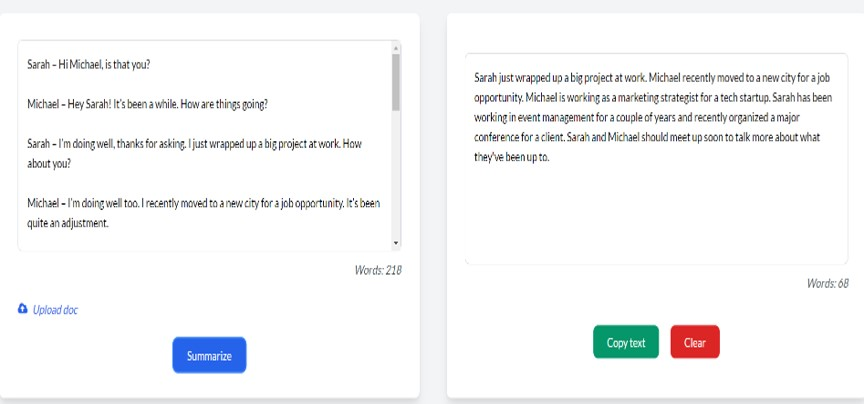

**Dialogue Summarization with Pegasus**:
This project fine-tunes a Pegasus model on dialogue data to generate concise and accurate summaries. It is designed to handle dialogue-rich datasets and create summarized outputs suitable for use cases such as customer service summaries, meeting notes, and chat dialogues.

**Project Overview**
Dataset: This project uses the SAMSum dataset for summarizing dialogues.
Model: Pegasus, fine-tuned for dialogue summarization.

Implementation: The fine-tuning process and evaluation metrics are detailed in the accompanying Jupyter notebook.
Due to the large size of the fine-tuned model and tokenizer files (~4GB), they are not included in the repository. Instead, the code in the notebook demonstrates how to download, fine-tune, and use Pegasus for summarization.

**Files in this Repository**:
dialogue_summarization.ipynb: Contains code to fine-tune the Pegasus model on the SAMSum dataset, save it locally, and evaluate it. 
This notebook walks through:
Data preparation,
Model and tokenizer setup,
Fine-tuning process,
Performance evaluation using ROUGE metrics.

Data Files and Project Structure: The project structure screenshot and example outputs are included to give a quick overview of how the repository is organized.

**Running the Project Locally**
**Clone the Repository:**

git clone https://github.com/your-username/your-repo-name.git
cd your-repo-name

Environment Setup: Install the necessary dependencies:
pip install -r requirements.txt

Execute the Notebook: Open dialogue_summarization.ipynb in google collab or any other cloud service which provide higher GPU for execution and run the cells to replicate the model fine-tuning and summarization.
<h3>Screenshot of File strructure</h3>

<h3>Screenshot of output</h3>

<h3>Screenshot of output</h3>

